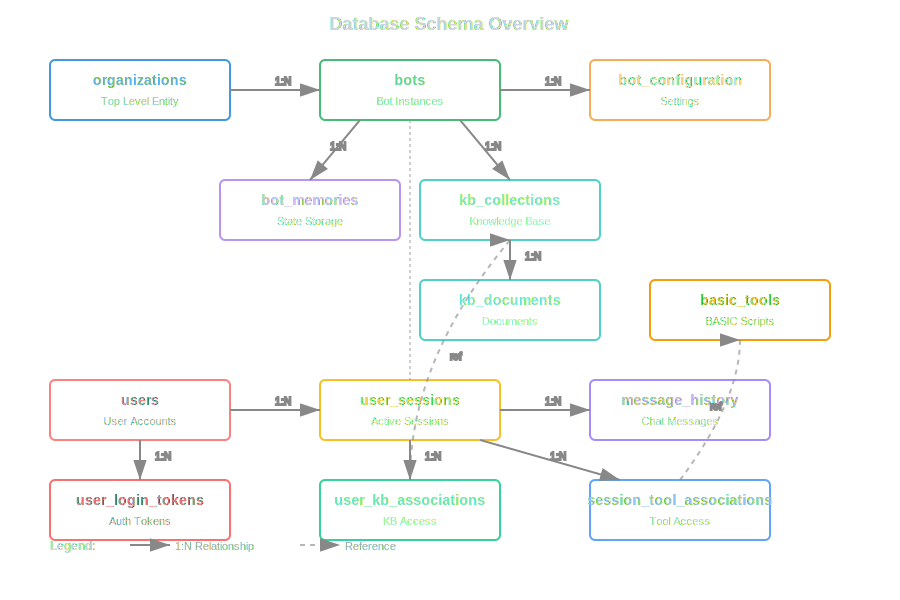

## Appendix I – Database Model

The core database schema for GeneralBots is defined in `src/shared/models.rs`. It uses **Diesel** with PostgreSQL and includes the following primary tables:

| Table | Description |
|-------|-------------|
| `users` | Stores user accounts, authentication tokens, and profile data. |
| `sessions` | Tracks active `BotSession` instances, their start/end timestamps, and associated user. |
| `knowledge_bases` | Metadata for each `.gbkb` collection (name, vector store configuration, creation date). |
| `messages` | Individual chat messages (role = user/assistant, content, timestamp, linked to a session). |
| `tools` | Registered custom tools per session (name, definition JSON, activation status). |
| `files` | References to files managed by the `.gbdrive` package (path, size, MIME type, storage location). |

### Relationships
- **User ↔ Sessions** – One‑to‑many: a user can have many sessions.
- **Session ↔ Messages** – One‑to‑many: each session contains a sequence of messages.
- **Session ↔ KnowledgeBase** – Many‑to‑one: a session uses a single knowledge base at a time.
- **Session ↔ Tools** – One‑to‑many: tools are scoped to the session that registers them.
- **File ↔ KnowledgeBase** – Optional link for documents stored in a knowledge base.

### Key Tables

**User Table**
- id: Integer primary key
- username: String
- email: String  
- password_hash: String
- created_at: Timestamp

**Session Table**
- id: Integer primary key
- user_id: Foreign key to User
- started_at: Timestamp
- last_active: Timestamp
- knowledge_base_id: Integer

**Message Table**
- id: Integer primary key
- session_id: Foreign key to Session
- role: String ("user" or "assistant")
- content: Text
- timestamp: Timestamp

The schema is automatically migrated when the server starts.

---

  

