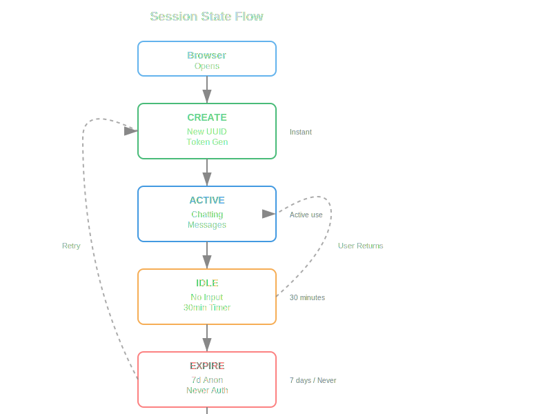
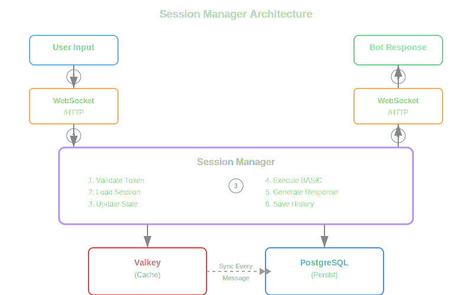

# Sessions and Channels

**Every conversation has memory.** Sessions are the beating heart of BotServer - they remember who you are, what you've said, and where you left off. Even if you close your browser and come back tomorrow.

## What Is a Session?

A session is a persistent conversation container that tracks:
- Who's talking (user identity)
- What's been said (message history)
- Current state (variables, context)
- Active tools and knowledge bases
- Bot configuration

Think of it like a phone call that can pause and resume anytime.

## How Sessions Start

### Web Interface
1. User opens `http://localhost:8080`
2. Browser gets a session token (UUID)
3. Token stored in localStorage
4. Session created in PostgreSQL
5. Cached in Valkey for speed

### API Access
```bash
# Get new session
curl -X POST http://localhost:8080/api/session
# Returns: {"session_id": "uuid-here", "token": "secret-token"}

# Use session
curl -H "Authorization: Bearer secret-token" \
     http://localhost:8080/api/chat
```

### Anonymous vs Authenticated
- **Anonymous**: Auto-created, temporary identity
- **Authenticated**: Linked to user account, permanent history

## Session Lifecycle

```

```

### Timeouts
- **Active**: No timeout while chatting
- **Idle**: 30 minutes default (configurable)
- **Expired**: 7 days for anonymous, never for authenticated

## What Gets Stored

### In PostgreSQL (Permanent)
```sql
sessions:
  id: uuid
  user_id: optional reference
  bot_id: which bot
  created_at: timestamp
  last_activity: timestamp
  
messages:
  session_id: reference
  role: user/assistant/system
  content: text
  timestamp: when sent
  
session_state:
  session_id: reference
  variables: jsonb (all BASIC variables)
  context: current knowledge/tools
```

### In Valkey Cache (Fast Access)
```
session:uuid:messages     # Recent messages
session:uuid:variables    # Current state
session:uuid:context      # Active KB/tools
session:uuid:last_activity
```

### Data Flow Diagram

```

```

## Session Variables

Variables set in BASIC scripts persist across messages:

```basic
' First message
name = HEAR
SET user_name = name

' Later message (minutes or days later)
GET user_name
TALK "Welcome back, " + user_name
```

Storage happens automatically:
- Write to cache immediately
- Persist to PostgreSQL every message
- Restore from DB if cache misses

## Context Management

Each session maintains its own context:

```basic
' Session A
USE KB "policies"
' Only this session sees policies

' Session B (different user)
USE KB "products"  
' This session only sees products
```

Contexts include:
- Active knowledge bases
- Loaded tools
- LLM configuration
- Custom prompts

## Multi-Bot Sessions

Different bots = different sessions:

```
/default → session-uuid-1 → default.gbai
/support → session-uuid-2 → support.gbai
/sales   → session-uuid-3 → sales.gbai
```

Each bot session is independent:
- Separate conversation history
- Different knowledge bases
- Unique configuration
- No data sharing

## Session Security

### Token Generation
- Cryptographically secure random
- 256-bit entropy
- URL-safe base64 encoded
- Unique per session

### Token Validation
```rust
// Every request validates:
1. Token exists
2. Token not expired
3. Token matches session
4. Session still active
```

### Security Features
- No session hijacking (tokens unguessable)
- No session fixation (new token each session)
- Automatic cleanup of old sessions
- Rate limiting per session

## Debugging Sessions

### View Current Session
```bash
# In BASIC script
session_id = GET "session.id"
TALK "Session: " + session_id
```

### Database Inspection
```sql
-- See all active sessions
SELECT id, user_id, last_activity 
FROM sessions 
WHERE last_activity > NOW() - INTERVAL '30 minutes';

-- View session messages
SELECT role, content, timestamp
FROM messages
WHERE session_id = 'uuid-here'
ORDER BY timestamp;
```

### Cache Inspection
```bash
# Using valkey-cli
valkey-cli
> KEYS session:*
> GET session:uuid:variables
```

## Session Limits

Default limits (configurable):
- **Message history**: Last 50 messages kept in context
- **Variable storage**: 1MB per session
- **File uploads**: 10MB per file
- **Concurrent sessions**: 1000 per server
- **Rate limit**: 60 messages per minute

## Advanced Features

### Session Handoff
Transfer conversation between channels:
```basic
' Start on web
TRANSFER_SESSION "email"
' Continue via email
```

### Session Merge
Combine anonymous session with login:
```basic
ON LOGIN
  MERGE_SESSION anonymous_id, user_id
END
```

### Session Export
Download conversation history:
```basic
history = GET "session.history"
SAVE "conversation.txt", history
```

### Session Templates
Pre-configure sessions:
```basic
' In start.bas
LOAD_TEMPLATE "customer_support"
' Sets up context, tools, initial message
```

## How It Works Automatically

Sessions require zero configuration:
- **Creation**: Automatic on first request
- **Storage**: Automatic to database and cache
- **Cleanup**: Automatic after expiration
- **Security**: Automatic token generation
- **Multi-channel**: Automatic adapter selection

You never need to manage sessions directly - just use the conversation keywords and everything happens behind the scenes.

## Common Patterns

### Welcome Back
```basic
last_visit = GET_BOT_MEMORY("last_visit_" + session_id)
if last_visit
  TALK "Welcome back! Last seen: " + last_visit
else
  TALK "Welcome! First time here?"
end
SET_BOT_MEMORY "last_visit_" + session_id, NOW()
```

### Progressive Disclosure
```basic
msg_count = GET "session.message_count"
if msg_count < 3
  TALK "I can help with basic questions"
else if msg_count < 10
  TALK "Try our advanced features!"
else
  TALK "You're a power user! Check tools menu"
end
```

### Session Persistence
```basic
' Save progress
SET checkpoint = "step_3_complete"

' Later, restore progress
GET checkpoint
if checkpoint == "step_3_complete"
  TALK "Let's continue from step 4"
end
```

## Troubleshooting

**Session not persisting?**
- Check PostgreSQL is running
- Verify cache is accessible
- Look for disk space issues

**Session expired too soon?**
- Adjust timeout in config.csv
- Check clock synchronization
- Monitor for memory pressure

**Can't resume session?**
- Token might be invalid
- Session could be expired
- Database connection issue

## Write Once, Run Everywhere

The same BASIC script runs across all channels - web, mobile apps, WhatsApp, Teams, email. Your investment in dialog development pays off everywhere:

```basic
' This same script works on:
' • Web interface
' • Mobile apps (via web view)
' • WhatsApp Business
' • Microsoft Teams
' • Email conversations
' • Voice assistants

TALK "Hello! How can I help?"
answer = HEAR
TALK "I understand you need help with: " + answer
```

Each channel adapter handles the specifics - you just write the conversation logic once.

## Summary

Sessions and channels work together seamlessly in BotServer. Sessions handle state management automatically across any channel, persist data reliably, and scale efficiently. You focus on the conversation flow - the system handles memory and multi-channel delivery.