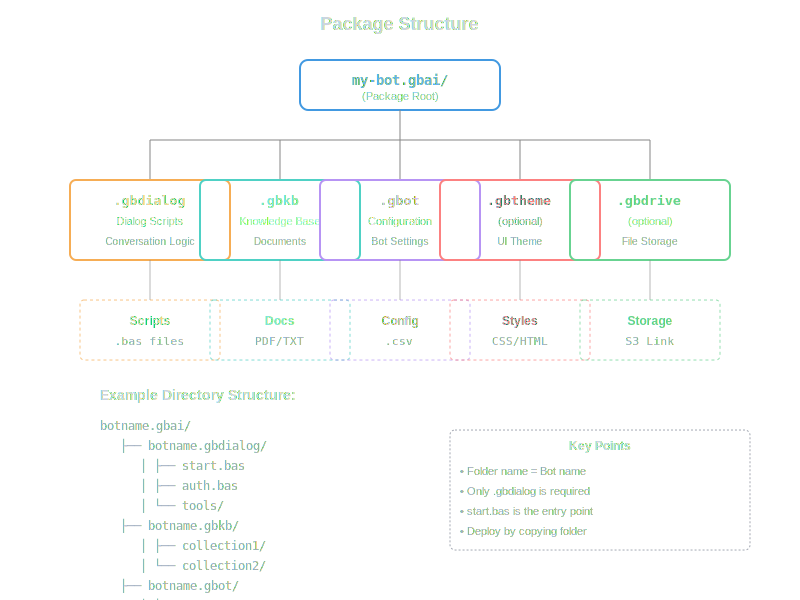

# Chapter 02: About Packages

BotServer uses a template-based package system to organize bot resources. Each bot is defined by a `.gbai` package directory containing various component subdirectories.

## Package Types

| Component | Extension | Role |
|-----------|-----------|------|
| Application Interface | `.gbai` | Root directory container for all bot resources |
| Dialog scripts | `.gbdialog` | BASIC-style conversational logic (`.bas` files) |
| Knowledge bases | `.gbkb` | Document collections for semantic search (each folder is a collection for LLM/vector DB) |
| Bot configuration | `.gbot` | CSV configuration file (`config.csv`) |
| UI themes | `.gbtheme` | Simple CSS theming - just place a `default.css` file |
| File storage | `.gbdrive` | General file storage for bot data (not KB) - used by SEND FILE, GET, SAVE AS |

## How Packages Work

### Template-Based System

BotServer uses a template-based approach:

1. **Templates Directory**: Bot packages are stored in `templates/` as `.gbai` folders
2. **Auto-Discovery**: During bootstrap, the system scans for `.gbai` directories
3. **Bot Creation**: Each `.gbai` package automatically creates a bot instance
4. **Storage Upload**: Template files are uploaded to object storage for persistence
5. **Runtime Loading**: Bots load their resources from storage when serving requests

## Package Structure



## Included Templates

BotServer includes 21 pre-built templates for various use cases: business bots (CRM, ERP, BI), communication (announcements, WhatsApp), AI tools (search, LLM utilities), and industry-specific solutions (education, legal, e-commerce).

See [Template Reference](./templates.md) for the complete catalog and detailed descriptions.

## Creating Your Own Package

To create a new bot package:

1. **Create Package Directory**:
   ```bash
   mkdir templates/mybot.gbai
   ```

2. **Add Subdirectories**:
   ```bash
   mkdir -p templates/mybot.gbai/mybot.gbdialog
   mkdir -p templates/mybot.gbai/mybot.gbkb
   mkdir -p templates/mybot.gbai/mybot.gbot
   ```

3. **Create Dialog Scripts**: Add `.bas` files to `.gbdialog/`

4. **Add Configuration**: Create `config.csv` in `.gbot/`

5. **Add Knowledge Base**: Place documents in `.gbkb/` subdirectories

6. **Restart BotServer**: Bootstrap process will detect and create your bot

## Package Lifecycle

```
Development → Bootstrap → Storage → Runtime → Updates
     ↓            ↓          ↓         ↓         ↓
  Edit files   Scan .gbai  Upload   Load from  Modify &
  in templates  folders    to drive  storage   restart
```

### Development Phase

- Create or modify files in `templates/your-bot.gbai/`
- Edit dialog scripts, configuration, and knowledge base documents
- Use version control (Git) to track changes

### Bootstrap Phase

- System scans `templates/` directory on startup
- Creates database records for new bots
- Generates bot names from folder names
- Applies default LLM and context settings

### Storage Phase

- Uploads all template files to object storage (drive)
- Indexes documents into vector database
- Stores configuration in database
- Ensures persistence across restarts

### Runtime Phase

- Bots load dialogs on-demand from storage
- Configuration is read from database
- Knowledge base queries hit vector database
- Session state maintained in cache

### Update Phase

- Modify template files as needed
- Restart BotServer to re-run bootstrap
- Changes are detected and applied
- Existing bot data is updated

## Multi-Bot Hosting

A single BotServer instance can host multiple bots:

- **Isolation**: Each bot has separate configuration and state
- **Resource Sharing**: Bots share infrastructure (database, cache, storage)
- **Independent Updates**: Update one bot without affecting others
- **Tenant Support**: Optional multi-tenancy for enterprise deployments

## Package Storage Locations

After bootstrap, package data is distributed across services:

- **Database**: Bot metadata, users, sessions, configuration
- **Object Storage (Drive)**: Template files, uploaded documents, assets
- **Vector Database**: Embeddings for semantic search
- **Cache**: Session cache, temporary data
- **File System**: Optional local caching

## Best Practices

### Naming Conventions

- Use consistent naming: `mybot.gbai`, `mybot.gbdialog`, `mybot.gbot`
- Use lowercase with hyphens: `customer-support.gbai`
- Avoid spaces and special characters

### Directory Organization

- Keep related dialogs in `.gbdialog/`
- Organize knowledge base by topic in `.gbkb/subdirectories/`
- Use descriptive collection names
- Include a `start.bas` as the entry point

### Configuration Management

- Store sensitive data in environment variables, not `config.csv`
- Document custom configuration parameters
- Use reasonable defaults
- Test configuration changes in development first

### Knowledge Base Structure

- Organize documents into logical collections
- Use subdirectories to separate topics
- Include metadata files if needed
- Keep documents in supported formats (PDF, TXT, MD)

### Version Control

- Packages are versioned in object storage with built-in versioning
- The drive automatically maintains version history
- For larger projects with split BASIC/LLM development teams:
  - Use Git to track source changes
  - Coordinate between dialog scripting and prompt engineering
- Storage versioning handles production deployments

## Package Component Details

For detailed information about each package type:

- **[.gbai Architecture](./gbai.md)** - Package structure and lifecycle
- **[.gbdialog Dialogs](./gbdialog.md)** - BASIC scripting and conversation flows
- **[.gbkb Knowledge Base](./gbkb.md)** - Document indexing and semantic search
- **[.gbot Bot Configuration](./gbot.md)** - Configuration parameters and settings
- **[.gbtheme UI Theming](./gbtheme.md)** - Simple CSS theming
- **[.gbdrive File Storage](./gbdrive.md)** - General file storage (not KB)

## Migration from Other Platforms

When migrating from traditional bot platforms, the key is to **let go** of complex logic:

- **Dialog Flows**: Use minimal BASIC scripts - let the LLM handle conversation flow
- **Intents/Entities**: Remove entirely - LLM understands naturally
- **State Machines**: Eliminate - LLM maintains context automatically
- **Knowledge Base**: Simply drop documents into `.gbkb/` folders
- **Complex Rules**: Replace with LLM intelligence

The migration philosophy is to "open hand" (abrir mão) - release control and trust the LLM. Instead of converting every dialog branch and condition, use the minimum BASIC needed for tools and let the LLM do the heavy lifting. This results in simpler, more maintainable, and more natural conversations.

Example: Instead of 100 lines of intent matching and routing, just:
```basic
' Let LLM understand and respond naturally
answer = LLM "Help the user with their request"
TALK answer
```

## Troubleshooting

### Bot Not Created

- Check `templates/` directory exists
- Verify `.gbai` folder name ends with extension
- Review bootstrap logs for errors
- Ensure subdirectories follow naming convention

### Configuration Not Applied

- Verify `config.csv` format is correct
- Check for typos in parameter names
- Restart BotServer after changes
- Review database for updated values

### Knowledge Base Not Indexed

- Ensure `.gbkb/` contains subdirectories with documents
- Check vector database is running and accessible
- Verify embedding model is configured
- Review indexing logs for errors

### Dialogs Not Executing

- Check `.bas` file syntax
- Verify `start.bas` exists
- Review runtime logs for errors
- Test with simple dialog first