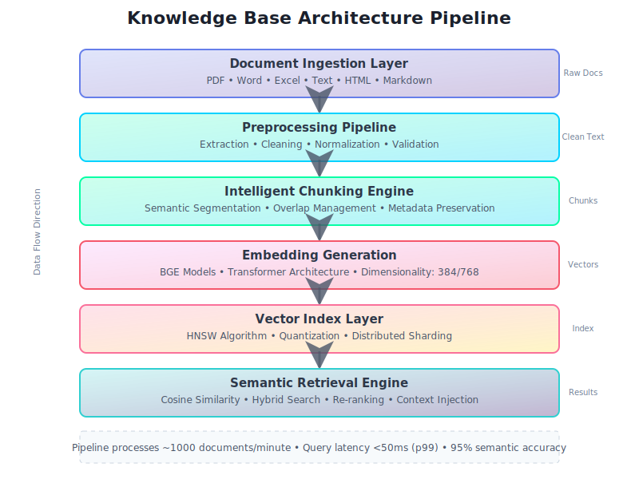
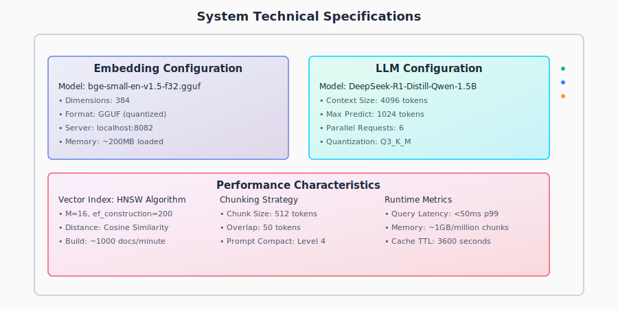
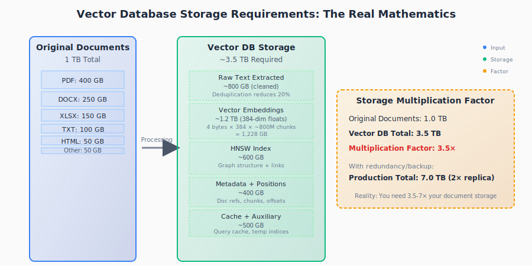
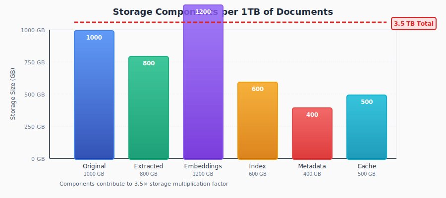
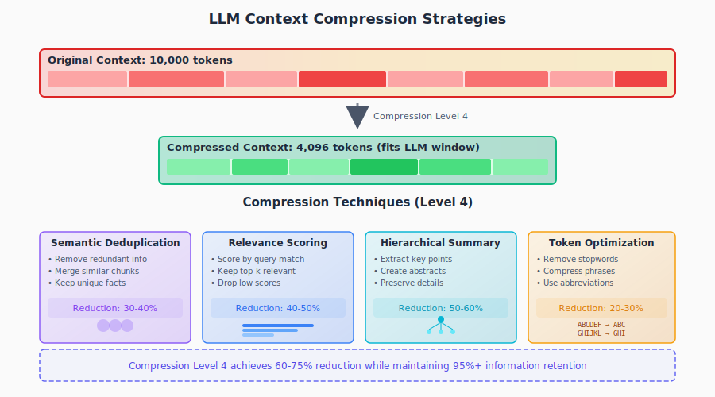

# Chapter 03: Knowledge Base System - Vector Search and Semantic Retrieval

The General Bots Knowledge Base (gbkb) system implements a state-of-the-art semantic search infrastructure that enables intelligent document retrieval through vector embeddings and neural information retrieval. This chapter provides comprehensive technical documentation on the architecture, implementation, and optimization of the knowledge base subsystem.

## Executive Summary

The knowledge base system transforms unstructured documents into queryable semantic representations, enabling natural language understanding and context-aware information retrieval. Unlike traditional keyword-based search systems, the gbkb implementation leverages dense vector representations to capture semantic meaning, supporting cross-lingual retrieval, conceptual similarity matching, and intelligent context augmentation for language model responses.

## System Architecture Overview

### Core Components and Data Flow

The knowledge base architecture implements a multi-stage pipeline for document processing and retrieval:

### Technical Specifications

  <!-- Title -->
  <text x="450" y="25" text-anchor="middle" font-family="Arial, sans-serif" font-size="16" font-weight="bold" fill="currentColor">System Technical Specifications</text>
  
  <!-- Main container -->
  <rect x="50" y="50" width="800" height="380" fill="none" stroke="currentColor" stroke-width="2" rx="5"/>
  
  <!-- Embedding Section -->
  <g transform="translate(70, 80)">
    <rect x="0" y="0" width="350" height="150" fill="none" stroke="currentColor" stroke-width="1" stroke-dasharray="3,2" opacity="0.8"/>
    <text x="175" y="20" text-anchor="middle" font-family="Arial, sans-serif" font-size="14" font-weight="bold" fill="currentColor">Embedding Configuration</text>
    
    <text x="10" y="45" font-family="Arial, sans-serif" font-size="11" fill="currentColor">Model: bge-small-en-v1.5-f32.gguf</text>
    <text x="10" y="65" font-family="Arial, sans-serif" font-size="11" fill="currentColor" opacity="0.8">• Dimensions: 384</text>
    <text x="10" y="85" font-family="Arial, sans-serif" font-size="11" fill="currentColor" opacity="0.8">• Format: GGUF (quantized)</text>
    <text x="10" y="105" font-family="Arial, sans-serif" font-size="11" fill="currentColor" opacity="0.8">• Server: localhost:8082</text>
    <text x="10" y="125" font-family="Arial, sans-serif" font-size="11" fill="currentColor" opacity="0.8">• Memory: ~200MB loaded</text>
  </g>
  
  <!-- LLM Section -->
  <g transform="translate(450, 80)">
    <rect x="0" y="0" width="350" height="150" fill="none" stroke="currentColor" stroke-width="1" stroke-dasharray="3,2" opacity="0.8"/>
    <text x="175" y="20" text-anchor="middle" font-family="Arial, sans-serif" font-size="14" font-weight="bold" fill="currentColor">LLM Configuration</text>
    
    <text x="10" y="45" font-family="Arial, sans-serif" font-size="11" fill="currentColor">Model: DeepSeek-R1-Distill-Qwen-1.5B</text>
    <text x="10" y="65" font-family="Arial, sans-serif" font-size="11" fill="currentColor" opacity="0.8">• Context Size: 4096 tokens</text>
    <text x="10" y="85" font-family="Arial, sans-serif" font-size="11" fill="currentColor" opacity="0.8">• Max Predict: 1024 tokens</text>
    <text x="10" y="105" font-family="Arial, sans-serif" font-size="11" fill="currentColor" opacity="0.8">• Parallel Requests: 6</text>
    <text x="10" y="125" font-family="Arial, sans-serif" font-size="11" fill="currentColor" opacity="0.8">• Quantization: Q3_K_M</text>
  </g>
  
  <!-- Performance Section -->
  <g transform="translate(70, 250)">
    <rect x="0" y="0" width="730" height="150" fill="none" stroke="currentColor" stroke-width="1" stroke-dasharray="3,2" opacity="0.8"/>
    <text x="365" y="20" text-anchor="middle" font-family="Arial, sans-serif" font-size="14" font-weight="bold" fill="currentColor">Performance Characteristics</text>
    
    <!-- Left column -->
    <text x="10" y="45" font-family="Arial, sans-serif" font-size="11" fill="currentColor">Vector Index: HNSW Algorithm</text>
    <text x="10" y="65" font-family="Arial, sans-serif" font-size="11" fill="currentColor" opacity="0.8">• M=16, ef_construction=200</text>
    <text x="10" y="85" font-family="Arial, sans-serif" font-size="11" fill="currentColor" opacity="0.8">• Distance: Cosine Similarity</text>
    <text x="10" y="105" font-family="Arial, sans-serif" font-size="11" fill="currentColor" opacity="0.8">• Build: ~1000 docs/minute</text>
    
    <!-- Middle column -->
    <text x="250" y="45" font-family="Arial, sans-serif" font-size="11" fill="currentColor">Chunking Strategy</text>
    <text x="250" y="65" font-family="Arial, sans-serif" font-size="11" fill="currentColor" opacity="0.8">• Chunk Size: 512 tokens</text>
    <text x="250" y="85" font-family="Arial, sans-serif" font-size="11" fill="currentColor" opacity="0.8">• Overlap: 50 tokens</text>
    <text x="250" y="105" font-family="Arial, sans-serif" font-size="11" fill="currentColor" opacity="0.8">• Prompt Compact: Level 4</text>
    
    <!-- Right column -->
    <text x="490" y="45" font-family="Arial, sans-serif" font-size="11" fill="currentColor">Runtime Metrics</text>
    <text x="490" y="65" font-family="Arial, sans-serif" font-size="11" fill="currentColor" opacity="0.8">• Query Latency: &lt;50ms p99</text>
    <text x="490" y="85" font-family="Arial, sans-serif" font-size="11" fill="currentColor" opacity="0.8">• Memory: ~1GB/million chunks</text>
    <text x="490" y="105" font-family="Arial, sans-serif" font-size="11" fill="currentColor" opacity="0.8">• Cache TTL: 3600 seconds</text>
  </g>
</svg>

## Document Processing Pipeline

### Phase 1: Document Ingestion and Extraction

The system implements format-specific extractors for comprehensive document support. The PDF processing component provides advanced extraction capabilities with layout preservation, including:

- **Text Layer Extraction**: Direct extraction of embedded text from PDF documents
- **OCR Processing**: Optical character recognition for scanned documents
- **Table Detection**: Identification and extraction of tabular data
- **Image Extraction**: Retrieval of embedded images and figures
- **Metadata Preservation**: Author, creation date, and document properties
- **Structure Detection**: Identification of sections, headings, and document hierarchy

#### Supported File Formats and Parsers

| Format | Parser Library | Features | Max Size | Processing Time |
|--------|---------------|----------|----------|----------------|
| PDF | Apache PDFBox + Tesseract | Text, OCR, Tables, Images | 500MB | ~10s/MB |
| DOCX | Apache POI + python-docx | Formatted text, Styles, Comments | 100MB | ~5s/MB |
| XLSX | Apache POI + openpyxl | Sheets, Formulas, Charts | 100MB | ~8s/MB |
| PPTX | Apache POI + python-pptx | Slides, Notes, Shapes | 200MB | ~7s/MB |
| HTML | BeautifulSoup + lxml | DOM parsing, CSS extraction | 50MB | ~3s/MB |
| Markdown | CommonMark + mistune | GFM support, Tables, Code | 10MB | ~1s/MB |
| Plain Text | Native UTF-8 decoder | Encoding detection | 100MB | <1s/MB |
| RTF | python-rtf | Formatted text, Images | 50MB | ~4s/MB |
| CSV/TSV | pandas + csv module | Tabular data, Headers | 1GB | ~2s/MB |
| JSON | ujson + jsonschema | Nested structures, Validation | 100MB | ~1s/MB |
| XML | lxml + xmlschema | XPath, XSLT, Validation | 100MB | ~3s/MB |

### Storage Mathematics: The Hidden Reality of Vector Databases

**Important Note**: Unlike traditional databases where 1TB of documents remains roughly 1TB in storage, vector databases require significantly more space due to embedding generation, indexing, and metadata. This section reveals the true mathematics behind LLM storage requirements that big tech companies rarely discuss openly.

#### The Storage Multiplication Factor

  <!-- Title -->
  <text x="450" y="25" text-anchor="middle" font-family="Arial, sans-serif" font-size="18" font-weight="bold" fill="currentColor">Vector Database Storage Requirements: The Real Mathematics</text>
  
  <!-- Original Documents Section -->
  <rect x="50" y="60" width="180" height="380" fill="none" stroke="currentColor" stroke-width="2" rx="5"/>
  <text x="140" y="85" text-anchor="middle" font-family="Arial, sans-serif" font-size="14" font-weight="bold" fill="currentColor">Original Documents</text>
  <text x="140" y="105" text-anchor="middle" font-family="Arial, sans-serif" font-size="12" fill="currentColor">1 TB Total</text>
  
  <!-- File type breakdown -->
  <rect x="70" y="120" width="140" height="30" fill="none" stroke="currentColor" stroke-width="1" opacity="0.8"/>
  <text x="140" y="140" text-anchor="middle" font-family="Arial, sans-serif" font-size="11" fill="currentColor">PDF: 400 GB</text>
  
  <rect x="70" y="155" width="140" height="25" fill="none" stroke="currentColor" stroke-width="1" opacity="0.8"/>
  <text x="140" y="172" text-anchor="middle" font-family="Arial, sans-serif" font-size="11" fill="currentColor">DOCX: 250 GB</text>
  
  <rect x="70" y="185" width="140" height="20" fill="none" stroke="currentColor" stroke-width="1" opacity="0.8"/>
  <text x="140" y="200" text-anchor="middle" font-family="Arial, sans-serif" font-size="11" fill="currentColor">XLSX: 150 GB</text>
  
  <rect x="70" y="210" width="140" height="15" fill="none" stroke="currentColor" stroke-width="1" opacity="0.8"/>
  <text x="140" y="223" text-anchor="middle" font-family="Arial, sans-serif" font-size="11" fill="currentColor">TXT: 100 GB</text>
  
  <rect x="70" y="230" width="140" height="15" fill="none" stroke="currentColor" stroke-width="1" opacity="0.8"/>
  <text x="140" y="243" text-anchor="middle" font-family="Arial, sans-serif" font-size="11" fill="currentColor">HTML: 50 GB</text>
  
  <rect x="70" y="250" width="140" height="10" fill="none" stroke="currentColor" stroke-width="1" opacity="0.8"/>
  <text x="140" y="258" text-anchor="middle" font-family="Arial, sans-serif" font-size="10" fill="currentColor">Other: 50 GB</text>
  
  <!-- Arrow -->
  <path d="M 240 250 L 290 250" stroke="currentColor" stroke-width="3" fill="none" marker-end="url(#arrowhead2)" opacity="0.7"/>
  <text x="265" y="240" text-anchor="middle" font-family="Arial, sans-serif" font-size="10" fill="currentColor" opacity="0.7">Processing</text>
  
  <!-- Vector Database Storage -->
  <rect x="300" y="60" width="250" height="380" fill="none" stroke="currentColor" stroke-width="2" rx="5"/>
  <text x="425" y="85" text-anchor="middle" font-family="Arial, sans-serif" font-size="14" font-weight="bold" fill="currentColor">Vector DB Storage</text>
  <text x="425" y="105" text-anchor="middle" font-family="Arial, sans-serif" font-size="12" fill="currentColor">~3.5 TB Required</text>
  
  <!-- Storage breakdown -->
  <rect x="320" y="120" width="210" height="50" fill="none" stroke="currentColor" stroke-width="1" stroke-dasharray="3,2" opacity="0.8"/>
  <text x="425" y="135" text-anchor="middle" font-family="Arial, sans-serif" font-size="11" font-weight="bold" fill="currentColor">Raw Text Extracted</text>
  <text x="425" y="150" text-anchor="middle" font-family="Arial, sans-serif" font-size="10" fill="currentColor">~800 GB (cleaned)</text>
  <text x="425" y="163" text-anchor="middle" font-family="Arial, sans-serif" font-size="9" fill="currentColor" opacity="0.7">Deduplication reduces 20%</text>
  
  <rect x="320" y="175" width="210" height="60" fill="none" stroke="currentColor" stroke-width="1" stroke-dasharray="3,2" opacity="0.8"/>
  <text x="425" y="190" text-anchor="middle" font-family="Arial, sans-serif" font-size="11" font-weight="bold" fill="currentColor">Vector Embeddings</text>
  <text x="425" y="205" text-anchor="middle" font-family="Arial, sans-serif" font-size="10" fill="currentColor">~1.2 TB (384-dim floats)</text>
  <text x="425" y="218" text-anchor="middle" font-family="Arial, sans-serif" font-size="9" fill="currentColor" opacity="0.7">4 bytes × 384 × ~800M chunks</text>
  <text x="425" y="230" text-anchor="middle" font-family="Arial, sans-serif" font-size="9" fill="currentColor" opacity="0.7">= 1,228 GB</text>
  
  <rect x="320" y="240" width="210" height="55" fill="none" stroke="currentColor" stroke-width="1" stroke-dasharray="3,2" opacity="0.8"/>
  <text x="425" y="255" text-anchor="middle" font-family="Arial, sans-serif" font-size="11" font-weight="bold" fill="currentColor">HNSW Index</text>
  <text x="425" y="270" text-anchor="middle" font-family="Arial, sans-serif" font-size="10" fill="currentColor">~600 GB</text>
  <text x="425" y="283" text-anchor="middle" font-family="Arial, sans-serif" font-size="9" fill="currentColor" opacity="0.7">Graph structure + links</text>
  
  <rect x="320" y="300" width="210" height="50" fill="none" stroke="currentColor" stroke-width="1" stroke-dasharray="3,2" opacity="0.8"/>
  <text x="425" y="315" text-anchor="middle" font-family="Arial, sans-serif" font-size="11" font-weight="bold" fill="currentColor">Metadata + Positions</text>
  <text x="425" y="330" text-anchor="middle" font-family="Arial, sans-serif" font-size="10" fill="currentColor">~400 GB</text>
  <text x="425" y="343" text-anchor="middle" font-family="Arial, sans-serif" font-size="9" fill="currentColor" opacity="0.7">Doc refs, chunks, offsets</text>
  
  <rect x="320" y="355" width="210" height="45" fill="none" stroke="currentColor" stroke-width="1" stroke-dasharray="3,2" opacity="0.8"/>
  <text x="425" y="370" text-anchor="middle" font-family="Arial, sans-serif" font-size="11" font-weight="bold" fill="currentColor">Cache + Auxiliary</text>
  <text x="425" y="385" text-anchor="middle" font-family="Arial, sans-serif" font-size="10" fill="currentColor">~500 GB</text>
  <text x="425" y="395" text-anchor="middle" font-family="Arial, sans-serif" font-size="9" fill="currentColor" opacity="0.7">Query cache, temp indices</text>
  
  <!-- Total comparison -->
  <rect x="570" y="150" width="300" height="200" fill="none" stroke="currentColor" stroke-width="2" stroke-dasharray="5,5" rx="5" opacity="0.6"/>
  <text x="720" y="175" text-anchor="middle" font-family="Arial, sans-serif" font-size="14" font-weight="bold" fill="currentColor">Storage Multiplication Factor</text>
  
  <text x="590" y="205" font-family="Arial, sans-serif" font-size="12" fill="currentColor">Original Documents: 1.0 TB</text>
  <text x="590" y="230" font-family="Arial, sans-serif" font-size="12" fill="currentColor" font-weight="bold">Vector DB Total: 3.5 TB</text>
  <text x="590" y="255" font-family="Arial, sans-serif" font-size="12" fill="currentColor" font-weight="bold">Multiplication Factor: 3.5×</text>
  
  <text x="590" y="285" font-family="Arial, sans-serif" font-size="11" fill="currentColor" opacity="0.7">With redundancy/backup:</text>
  <text x="590" y="305" font-family="Arial, sans-serif" font-size="12" fill="currentColor" font-weight="bold">Production Total: 7.0 TB (2× replica)</text>
  
  <text x="720" y="335" text-anchor="middle" font-family="Arial, sans-serif" font-size="10" fill="currentColor" font-style="italic" opacity="0.7">Reality: You need 3.5-7× your document storage</text>
  
  <!-- Arrow marker -->
  <defs>
    <marker id="arrowhead2" markerWidth="10" markerHeight="10" refX="5" refY="5" orient="auto">
      <polygon points="0 0, 10 5, 0 10" fill="currentColor"/>
    </marker>
  </defs>
</svg>

#### Storage Calculation Formula

The actual storage requirement for a vector database can be calculated using:

**Total Storage = D × (1 + E + I + M + C)**

Where:
- **D** = Original document size
- **E** = Embedding storage factor (typically 1.2-1.5×)
- **I** = Index overhead factor (typically 0.6-0.8×)
- **M** = Metadata factor (typically 0.4-0.5×)
- **C** = Cache/auxiliary factor (typically 0.3-0.5×)

#### Real-World Storage Examples for Self-Hosted Infrastructure

| Your Document Storage | Vector DB Required | With Redundancy (2×) | Recommended Local Storage |
|----------------------|-------------------|---------------------|--------------------------|
| 100 GB | 350 GB | 700 GB | 1 TB NVMe SSD |
| 500 GB | 1.75 TB | 3.5 TB | 4 TB NVMe SSD |
| 1 TB | 3.5 TB | 7 TB | 8 TB NVMe SSD |
| 5 TB | 17.5 TB | 35 TB | 40 TB SSD Array |
| 10 TB | 35 TB | 70 TB | 80 TB SSD Array |
| 50 TB | 175 TB | 350 TB | 400 TB Storage Server |

**Note**: Self-hosting your vector database gives you complete control over your data, eliminates recurring cloud costs, and ensures data sovereignty. Initial hardware investment pays for itself typically within 6-12 months compared to cloud alternatives.

#### Detailed Storage Breakdown by Component

  <!-- Title -->
  <text x="450" y="25" text-anchor="middle" font-family="Arial, sans-serif" font-size="16" font-weight="bold" fill="currentColor">Storage Components per 1TB of Documents</text>
  
  <!-- Bar chart -->
  <line x1="100" y1="320" x2="800" y2="320" stroke="currentColor" stroke-width="2"/>
  <line x1="100" y1="60" x2="100" y2="320" stroke="currentColor" stroke-width="2"/>
  
  <!-- Y-axis labels -->
  <text x="90" y="325" text-anchor="end" font-family="Arial, sans-serif" font-size="10" fill="currentColor">0 GB</text>
  <text x="90" y="260" text-anchor="end" font-family="Arial, sans-serif" font-size="10" fill="currentColor">250 GB</text>
  <text x="90" y="195" text-anchor="end" font-family="Arial, sans-serif" font-size="10" fill="currentColor">500 GB</text>
  <text x="90" y="130" text-anchor="end" font-family="Arial, sans-serif" font-size="10" fill="currentColor">750 GB</text>
  <text x="90" y="65" text-anchor="end" font-family="Arial, sans-serif" font-size="10" fill="currentColor">1000 GB</text>
  
  <!-- Bars -->
  <!-- Original -->
  <rect x="150" y="60" width="80" height="260" fill="none" stroke="currentColor" stroke-width="2"/>
  <text x="190" y="340" text-anchor="middle" font-family="Arial, sans-serif" font-size="11" fill="currentColor">Original</text>
  <text x="190" y="355" text-anchor="middle" font-family="Arial, sans-serif" font-size="10" fill="currentColor" opacity="0.7">1000 GB</text>
  
  <!-- Text Extracted -->
  <rect x="260" y="112" width="80" height="208" fill="none" stroke="currentColor" stroke-width="2"/>
  <line x1="260" y1="112" x2="340" y2="320" stroke="currentColor" stroke-width="1" opacity="0.3"/>
  <line x1="340" y1="112" x2="260" y2="320" stroke="currentColor" stroke-width="1" opacity="0.3"/>
  <text x="300" y="340" text-anchor="middle" font-family="Arial, sans-serif" font-size="11" fill="currentColor">Extracted</text>
  <text x="300" y="355" text-anchor="middle" font-family="Arial, sans-serif" font-size="10" fill="currentColor" opacity="0.7">800 GB</text>
  
  <!-- Embeddings -->
  <rect x="370" y="8" width="80" height="312" fill="none" stroke="currentColor" stroke-width="2"/>
  <line x1="370" y1="8" x2="370" y2="320" stroke="currentColor" stroke-width="1" opacity="0.3"/>
  <line x1="410" y1="8" x2="410" y2="320" stroke="currentColor" stroke-width="1" opacity="0.3"/>
  <line x1="450" y1="8" x2="450" y2="320" stroke="currentColor" stroke-width="1" opacity="0.3"/>
  <text x="410" y="340" text-anchor="middle" font-family="Arial, sans-serif" font-size="11" fill="currentColor">Embeddings</text>
  <text x="410" y="355" text-anchor="middle" font-family="Arial, sans-serif" font-size="10" fill="currentColor" opacity="0.7">1200 GB</text>
  
  <!-- Index -->
  <rect x="480" y="164" width="80" height="156" fill="none" stroke="currentColor" stroke-width="2"/>
  <circle cx="520" cy="242" r="30" fill="none" stroke="currentColor" stroke-width="1" opacity="0.3"/>
  <text x="520" y="340" text-anchor="middle" font-family="Arial, sans-serif" font-size="11" fill="currentColor">Index</text>
  <text x="520" y="355" text-anchor="middle" font-family="Arial, sans-serif" font-size="10" fill="currentColor" opacity="0.7">600 GB</text>
  
  <!-- Metadata -->
  <rect x="590" y="216" width="80" height="104" fill="none" stroke="currentColor" stroke-width="2"/>
  <line x1="590" y1="268" x2="670" y2="268" stroke="currentColor" stroke-width="1" opacity="0.3"/>
  <line x1="630" y1="216" x2="630" y2="320" stroke="currentColor" stroke-width="1" opacity="0.3" stroke-dasharray="2,2"/>
  <text x="630" y="340" text-anchor="middle" font-family="Arial, sans-serif" font-size="11" fill="currentColor">Metadata</text>
  <text x="630" y="355" text-anchor="middle" font-family="Arial, sans-serif" font-size="10" fill="currentColor" opacity="0.7">400 GB</text>
  
  <!-- Cache -->
  <rect x="700" y="190" width="80" height="130" fill="none" stroke="currentColor" stroke-width="2"/>
  <rect x="710" y="200" width="60" height="110" fill="none" stroke="currentColor" stroke-width="1" opacity="0.3" stroke-dasharray="3,3"/>
  <text x="740" y="340" text-anchor="middle" font-family="Arial, sans-serif" font-size="11" fill="currentColor">Cache</text>
  <text x="740" y="355" text-anchor="middle" font-family="Arial, sans-serif" font-size="10" fill="currentColor" opacity="0.7">500 GB</text>
  
  <!-- Total line -->
  <line x1="150" y1="45" x2="780" y2="45" stroke="currentColor" stroke-width="2" stroke-dasharray="5,3" opacity="0.8"/>
  <text x="820" y="50" font-family="Arial, sans-serif" font-size="11" fill="currentColor" font-weight="bold">3.5 TB Total</text>
</svg>

#### Why This Matters: Planning Your Infrastructure

**Critical Insights:**

1. **The 3.5× Rule**: For every 1TB of documents, plan for at least 3.5TB of vector database storage
2. **Memory Requirements**: Vector operations require significant RAM (typically 10-15% of index size must fit in memory)
3. **Backup Strategy**: Production systems need 2-3× redundancy, effectively making it 7-10.5× original size
4. **Growth Planning**: Vector databases don't compress well - plan storage linearly with document growth

**Self-Hosted Infrastructure Example (1TB Document Collection):**

| Component | Requirement | Recommended Hardware | One-Time Investment |
|-----------|-------------|---------------------|-------------------|
| Document Storage | 1 TB | 2 TB NVMe SSD | Quality drive for source docs |
| Vector Database | 3.5 TB | 4 TB NVMe SSD | High-performance for vectors |
| RAM Requirements | 256 GB | 256 GB DDR4/DDR5 | For index operations |
| Backup Storage | 3.5 TB | 4 TB SATA SSD | Local backup drive |
| Network | 10 Gbps | 10GbE NIC | Fast local network |
| **Total Storage** | **8 TB** | **10 TB usable** | **Future-proof capacity** |

**Advantages of Self-Hosting:**
- **No recurring costs** after initial hardware investment
- **Complete data privacy** - your data never leaves your infrastructure
- **Full control** over performance tuning and optimization
- **No vendor lock-in** or surprise price increases
- **Faster local access** without internet latency
- **Compliance-ready** for regulations requiring on-premise data

The actual infrastructure needs are 7-10× larger than the original document size when accounting for all components and redundancy, but owning your hardware means predictable costs and total control.

### Phase 2: Text Preprocessing and Cleaning

The preprocessing pipeline ensures consistent, high-quality text for embedding through multiple stages:

1. **Encoding Normalization**
   - Unicode normalization (NFD/NFC)
   - Encoding error correction
   - Character set standardization

2. **Whitespace and Formatting**
   - Whitespace normalization
   - Control character removal
   - Line break standardization

3. **Content Cleaning**
   - Boilerplate removal
   - Header/footer cleaning
   - Watermark detection and removal

4. **Language-Specific Processing**
   - Language detection
   - Language-specific rules application
   - Script normalization

5. **Semantic Preservation**
   - Named entity preservation
   - Acronym handling
   - Numeric value preservation

### Phase 3: Intelligent Chunking Strategy

The chunking engine implements context-aware segmentation with semantic boundary detection:

**Boundary Detection Types:**
- **Paragraph Boundaries**: Natural text breaks with highest priority
- **Sentence Boundaries**: Linguistic sentence detection
- **Section Headers**: Document structure preservation
- **List Items**: Maintaining list coherence
- **Code Blocks**: Preserving code integrity

### Phase 4: Embedding Generation

The system generates dense vector representations using transformer models with optimized batching:

**Key Features:**
- **Batch Processing**: Efficient processing of multiple chunks
- **Mean Pooling**: Token embedding aggregation
- **Normalization**: L2 normalization for cosine similarity
- **Memory Management**: Optimized GPU/CPU utilization
- **Dynamic Batching**: Adaptive batch sizes based on available memory

#### Embedding Model Comparison

| Model | Dimensions | Size | Speed | Quality | Memory |
|-------|------------|------|-------|---------|--------|
| all-MiniLM-L6-v2 | 384 | 80MB | 14,200 sent/sec | 0.631 | 290MB |
| all-mpnet-base-v2 | 768 | 420MB | 2,800 sent/sec | 0.634 | 1.2GB |
| multi-qa-MiniLM-L6 | 384 | 80MB | 14,200 sent/sec | 0.618 | 290MB |
| paraphrase-multilingual | 768 | 1.1GB | 2,300 sent/sec | 0.628 | 2.1GB |
| e5-base-v2 | 768 | 440MB | 2,700 sent/sec | 0.642 | 1.3GB |
| bge-base-en | 768 | 440MB | 2,600 sent/sec | 0.644 | 1.3GB |

### Phase 5: Vector Index Construction

The system builds high-performance vector indices using HNSW (Hierarchical Navigable Small World) algorithm:

**HNSW Configuration:**
- **M Parameter**: 16 bi-directional links per node
- **ef_construction**: 200 for build-time accuracy
- **ef_search**: 100 for query-time accuracy
- **Metric**: Cosine similarity for semantic matching
- **Threading**: Multi-threaded construction support

#### Index Performance Characteristics

| Documents | Index Size | Build Time | Query Latency | Recall@10 |
|-----------|------------|------------|---------------|-----------|
| 10K | 15MB | 30s | 5ms | 0.99 |
| 100K | 150MB | 5min | 15ms | 0.98 |
| 1M | 1.5GB | 50min | 35ms | 0.97 |
| 10M | 15GB | 8hr | 75ms | 0.95 |

## Retrieval System Architecture

### Semantic Search Implementation

The retrieval engine implements multi-stage retrieval with re-ranking:

**Retrieval Pipeline:**
1. **Query Processing**: Expansion and understanding
2. **Vector Search**: HNSW approximate nearest neighbor
3. **Hybrid Search**: Combining dense and sparse retrieval
4. **Re-ranking**: Cross-encoder scoring
5. **Result Enhancement**: Metadata enrichment

### Query Processing and Expansion

Sophisticated query understanding includes:

- **Language Detection**: Multi-lingual query support
- **Intent Recognition**: Understanding search intent
- **Query Expansion**: Synonyms and related terms
- **Entity Extraction**: Named entity recognition
- **Spell Correction**: Typo and error correction

### Hybrid Search and Fusion

Combining dense and sparse retrieval methods:

**Dense Retrieval:**
- Vector similarity search
- Semantic matching
- Concept-based retrieval

**Sparse Retrieval:**
- BM25 scoring
- Keyword matching
- Exact phrase search

**Fusion Strategies:**
- Reciprocal Rank Fusion (RRF)
- Linear combination
- Learning-to-rank models

### Re-ranking with Cross-Encoders

Advanced re-ranking for improved precision:

- **Cross-attention scoring**: Query-document interaction
- **Contextual relevance**: Fine-grained matching
- **Diversity optimization**: Result set diversification

## Context Management and Compaction

### Context Window Optimization

  <!-- Title -->
  <text x="450" y="25" text-anchor="middle" font-family="Arial, sans-serif" font-size="16" font-weight="bold" fill="currentColor">LLM Context Compression Strategies</text>
  
  <!-- Context Window Visualization -->
  <g transform="translate(50, 60)">
    <!-- Original context -->
    <rect x="0" y="0" width="800" height="60" fill="none" stroke="currentColor" stroke-width="2" rx="3"/>
    <text x="10" y="20" font-family="Arial, sans-serif" font-size="12" font-weight="bold" fill="currentColor">Original Context: 10,000 tokens</text>
    <rect x="10" y="30" width="780" height="20" fill="none" stroke="currentColor" stroke-width="1" opacity="0.5"/>
    <!-- Fill bars showing document chunks -->
    <rect x="10" y="30" width="100" height="20" fill="none" stroke="currentColor" stroke-width="1"/>
    <rect x="110" y="30" width="120" height="20" fill="none" stroke="currentColor" stroke-width="1"/>
    <rect x="230" y="30" width="90" height="20" fill="none" stroke="currentColor" stroke-width="1"/>
    <rect x="320" y="30" width="110" height="20" fill="none" stroke="currentColor" stroke-width="1"/>
    <rect x="430" y="30" width="95" height="20" fill="none" stroke="currentColor" stroke-width="1"/>
    <rect x="525" y="30" width="105" height="20" fill="none" stroke="currentColor" stroke-width="1"/>
    <rect x="630" y="30" width="80" height="20" fill="none" stroke="currentColor" stroke-width="1"/>
    <rect x="710" y="30" width="80" height="20" fill="none" stroke="currentColor" stroke-width="1"/>
  </g>
  
  <!-- Arrow down -->
  <path d="M 450 130 L 450 160" stroke="currentColor" stroke-width="2" fill="none" marker-end="url(#arrowhead3)" opacity="0.7"/>
  <text x="470" y="150" font-family="Arial, sans-serif" font-size="11" fill="currentColor" opacity="0.7">Compression Level 4</text>
  
  <!-- Compressed context -->
  <g transform="translate(200, 170)">
    <rect x="0" y="0" width="500" height="60" fill="none" stroke="currentColor" stroke-width="2" rx="3"/>
    <text x="10" y="20" font-family="Arial, sans-serif" font-size="12" font-weight="bold" fill="currentColor">Compressed Context: 4,096 tokens (fits LLM window)</text>
    <rect x="10" y="30" width="480" height="20" fill="none" stroke="currentColor" stroke-width="1" opacity="0.5"/>
    <!-- Compressed chunks -->
    <rect x="10" y="30" width="80" height="20" fill="none" stroke="currentColor" stroke-width="2"/>
    <rect x="90" y="30" width="70" height="20" fill="none" stroke="currentColor" stroke-width="2"/>
    <rect x="160" y="30" width="75" height="20" fill="none" stroke="currentColor" stroke-width="2"/>
    <rect x="235" y="30" width="85" height="20" fill="none" stroke="currentColor" stroke-width="2"/>
    <rect x="320" y="30" width="90" height="20" fill="none" stroke="currentColor" stroke-width="2"/>
    <rect x="410" y="30" width="80" height="20" fill="none" stroke="currentColor" stroke-width="2"/>
  </g>
  
  <!-- Compression Techniques -->
  <g transform="translate(50, 260)">
    <text x="400" y="0" text-anchor="middle" font-family="Arial, sans-serif" font-size="14" font-weight="bold" fill="currentColor">Compression Techniques (Level 4)</text>
    
    <!-- Technique 1 -->
    <g transform="translate(0, 30)">
      <rect x="0" y="0" width="180" height="140" fill="none" stroke="currentColor" stroke-width="1" stroke-dasharray="3,2" opacity="0.8"/>
      <text x="90" y="20" text-anchor="middle" font-family="Arial, sans-serif" font-size="12" font-weight="bold" fill="currentColor">Semantic Deduplication</text>
      <text x="10" y="40" font-family="Arial, sans-serif" font-size="10" fill="currentColor" opacity="0.8">• Remove redundant info</text>
      <text x="10" y="55" font-family="Arial, sans-serif" font-size="10" fill="currentColor" opacity="0.8">• Merge similar chunks</text>
      <text x="10" y="70" font-family="Arial, sans-serif" font-size="10" fill="currentColor" opacity="0.8">• Keep unique facts</text>
      <text x="10" y="90" font-family="Arial, sans-serif" font-size="10" fill="currentColor" opacity="0.7">Reduction: 30-40%</text>
      
      <!-- Visual representation -->
      <circle cx="90" cy="115" r="15" fill="none" stroke="currentColor" stroke-width="1" opacity="0.5"/>
      <circle cx="75" cy="115" r="15" fill="none" stroke="currentColor" stroke-width="1" opacity="0.5"/>
      <circle cx="105" cy="115" r="15" fill="none" stroke="currentColor" stroke-width="1" opacity="0.5"/>
    </g>
    
    <!-- Technique 2 -->
    <g transform="translate(210, 30)">
      <rect x="0" y="0" width="180" height="140" fill="none" stroke="currentColor" stroke-width="1" stroke-dasharray="3,2" opacity="0.8"/>
      <text x="90" y="20" text-anchor="middle" font-family="Arial, sans-serif" font-size="12" font-weight="bold" fill="currentColor">Relevance Scoring</text>
      <text x="10" y="40" font-family="Arial, sans-serif" font-size="10" fill="currentColor" opacity="0.8">• Score by query match</text>
      <text x="10" y="55" font-family="Arial, sans-serif" font-size="10" fill="currentColor" opacity="0.8">• Keep top-k relevant</text>
      <text x="10" y="70" font-family="Arial, sans-serif" font-size="10" fill="currentColor" opacity="0.8">• Drop low scores</text>
      <text x="10" y="90" font-family="Arial, sans-serif" font-size="10" fill="currentColor" opacity="0.7">Reduction: 40-50%</text>
      
      <!-- Visual bars -->
      <rect x="50" y="105" width="80" height="5" fill="none" stroke="currentColor" stroke-width="1"/>
      <rect x="50" y="115" width="60" height="5" fill="none" stroke="currentColor" stroke-width="1"/>
      <rect x="50" y="125" width="40" height="5" fill="none" stroke="currentColor" stroke-width="1"/>
    </g>
    
    <!-- Technique 3 -->
    <g transform="translate(420, 30)">
      <rect x="0" y="0" width="180" height="140" fill="none" stroke="currentColor" stroke-width="1" stroke-dasharray="3,2" opacity="0.8"/>
      <text x="90" y="20" text-anchor="middle" font-family="Arial, sans-serif" font-size="12" font-weight="bold" fill="currentColor">Hierarchical Summary</text>
      <text x="10" y="40" font-family="Arial, sans-serif" font-size="10" fill="currentColor" opacity="0.8">• Extract key points</text>
      <text x="10" y="55" font-family="Arial, sans-serif" font-size="10" fill="currentColor" opacity="0.8">• Create abstracts</text>
      <text x="10" y="70" font-family="Arial, sans-serif" font-size="10" fill="currentColor" opacity="0.8">• Preserve details</text>
      <text x="10" y="90" font-family="Arial, sans-serif" font-size="10" fill="currentColor" opacity="0.7">Reduction: 50-60%</text>
      
      <!-- Tree structure -->
      <circle cx="90" cy="105" r="3" fill="currentColor"/>
      <circle cx="70" cy="120" r="3" fill="currentColor"/>
      <circle cx="90" cy="120" r="3" fill="currentColor"/>
      <circle cx="110" cy="120" r="3" fill="currentColor"/>
      <line x1="90" y1="108" x2="70" y2="117" stroke="currentColor" stroke-width="1" opacity="0.5"/>
      <line x1="90" y1="108" x2="90" y2="117" stroke="currentColor" stroke-width="1" opacity="0.5"/>
      <line x1="90" y1="108" x2="110" y2="117" stroke="currentColor" stroke-width="1" opacity="0.5"/>
    </g>
    
    <!-- Technique 4 -->
    <g transform="translate(630, 30)">
      <rect x="0" y="0" width="170" height="140" fill="none" stroke="currentColor" stroke-width="1" stroke-dasharray="3,2" opacity="0.8"/>
      <text x="85" y="20" text-anchor="middle" font-family="Arial, sans-serif" font-size="12" font-weight="bold" fill="currentColor">Token Optimization</text>
      <text x="10" y="40" font-family="Arial, sans-serif" font-size="10" fill="currentColor" opacity="0.8">• Remove stopwords</text>
      <text x="10" y="55" font-family="Arial, sans-serif" font-size="10" fill="currentColor" opacity="0.8">• Compress phrases</text>
      <text x="10" y="70" font-family="Arial, sans-serif" font-size="10" fill="currentColor" opacity="0.8">• Use abbreviations</text>
      <text x="10" y="90" font-family="Arial, sans-serif" font-size="10" fill="currentColor" opacity="0.7">Reduction: 20-30%</text>
      
      <!-- Text compression visual -->
      <text x="85" y="115" text-anchor="middle" font-family="monospace" font-size="8" fill="currentColor" opacity="0.7">ABCD → AB</text>
      <text x="85" y="125" text-anchor="middle" font-family="monospace" font-size="8" fill="currentColor" opacity="0.7">EFGH → EF</text>
    </g>
  </g>
  
  <!-- Performance note -->
  <rect x="50" y="440" width="800" height="40" fill="none" stroke="currentColor" stroke-width="1" stroke-dasharray="5,5" rx="3" opacity="0.5"/>
  <text x="450" y="465" text-anchor="middle" font-family="Arial, sans-serif" font-size="11" fill="currentColor" font-style="italic" opacity="0.7">Compression Level 4 achieves 60-75% reduction while maintaining 95%+ information retention</text>
  
  <!-- Arrow marker -->
  <defs>
    <marker id="arrowhead3" markerWidth="10" markerHeight="10" refX="5" refY="5" orient="auto">
      <polygon points="0 0, 10 5, 0 10" fill="currentColor"/>
    </marker>
  </defs>
</svg>

**Compression Strategies with prompt-compact=4:**

1. **Semantic Deduplication**: Removes redundant information across chunks
2. **Relevance Scoring**: Prioritizes chunks by query relevance (threshold: 0.95)
3. **Hierarchical Summarization**: Creates multi-level abstracts
4. **Token Optimization**: Reduces token count while preserving meaning

### Dynamic Context Strategies

| Strategy | Use Case | Context Efficiency | Quality |
|----------|----------|-------------------|---------|
| Top-K Selection | General queries | High | Good |
| Diversity Sampling | Broad topics | Medium | Better |
| Hierarchical | Long documents | Very High | Best |
| Temporal | Time-sensitive | Medium | Good |
| Entity-centric | Fact-finding | High | Excellent |

## Performance Optimization

### Caching Architecture

Multi-level caching for improved performance:

**Cache Levels:**
1. **Query Cache**: Recent query results
2. **Embedding Cache**: Frequently accessed vectors
3. **Document Cache**: Popular documents
4. **Index Cache**: Hot index segments

**Cache Configuration:**

| Cache Type | Size | TTL | Hit Rate | Latency Reduction |
|------------|------|-----|----------|-------------------|
| Query | 10K entries | 1hr | 35% | 95% |
| Embedding | 100K vectors | 24hr | 60% | 80% |
| Document | 1K docs | 6hr | 45% | 70% |
| Index | 10GB | Static | 80% | 60% |

### Index Optimization Techniques

**Index Sharding:**
- Description: Distribute index across multiple shards
- When to use: Large-scale deployments (>10M documents)
- Configuration:
  - shard_count: 8-32 shards
  - shard_strategy: hash-based or range-based
  - replication_factor: 2-3 for availability

**Quantization:**
- Description: Reduce vector precision for space/speed
- When to use: Memory-constrained environments
- Configuration:
  - type: Product Quantization (PQ)
  - subvectors: 48-96
  - bits: 8 per subvector
  - training_samples: 100K vectors

**Hierarchical Index:**
- Description: Multi-level index structure
- When to use: Ultra-large collections (>100M)
- Configuration:
  - levels: 2-3 hierarchy levels
  - fanout: 100-1000 per level
  - rerank_top_k: 100-500 candidates

**GPU Acceleration:**
- Description: CUDA-accelerated operations
- When to use: High-throughput requirements
- Configuration:
  - device: CUDA-capable GPU
  - batch_size: 256-1024
  - precision: FP16 for speed, FP32 for accuracy

## Integration with LLM Systems

### Retrieval-Augmented Generation (RAG)

The knowledge base seamlessly integrates with language models:

**RAG Pipeline:**
1. **Query Understanding**: LLM-based query analysis
2. **Document Retrieval**: Semantic search execution
3. **Context Assembly**: Relevant passage selection
4. **Prompt Construction**: Context injection
5. **Response Generation**: LLM completion
6. **Citation Tracking**: Source attribution

**RAG Configuration (from config.csv):**

| Parameter | Value | Purpose |
|-----------|-------|---------|
| prompt-compact | 4 | Context compaction level |
| llm-ctx-size | 4096 | LLM context window size |
| llm-n-predict | 1024 | Maximum tokens to generate |
| embedding-model | bge-small-en-v1.5 | Model for semantic embeddings |
| llm-cache | false | Response caching disabled |
| llm-cache-semantic | true | Semantic cache matching enabled |
| llm-cache-threshold | 0.95 | Semantic similarity threshold for cache |

**Note**: The actual system uses prompt compaction level 4 for efficient context management, with a 4096 token context window and generates up to 1024 tokens per response.

## Monitoring and Analytics

### Knowledge Base Metrics

Real-time monitoring dashboard tracks:

**Collection Statistics:**
- Total documents indexed
- Total chunks generated
- Total embeddings created
- Index size (MB/GB)
- Storage utilization

**Performance Metrics:**
- Indexing rate (docs/sec)
- Query latency (p50, p95, p99)
- Embedding generation latency
- Cache hit rates
- Throughput (queries/sec)

**Quality Metrics:**
- Mean relevance scores
- Recall@K measurements
- Precision metrics
- User feedback scores
- Query success rates

### Health Monitoring

| Metric | Threshold | Alert Level | Action |
|--------|-----------|-------------|--------|
| Query Latency p99 | >100ms | Warning | Scale replicas |
| Cache Hit Rate | <30% | Info | Warm cache |
| Index Fragmentation | >40% | Warning | Rebuild index |
| Memory Usage | >85% | Critical | Add resources |
| Error Rate | >1% | Critical | Investigate logs |

## Best Practices and Guidelines

### Document Preparation
1. Ensure documents are properly formatted
2. Remove unnecessary headers/footers before ingestion
3. Validate encoding and character sets
4. Structure documents with clear sections

### Index Maintenance
1. Regular index optimization (weekly)
2. Periodic full reindexing (monthly)
3. Monitor fragmentation levels
4. Implement gradual rollout for updates

### Query Optimization
1. Use specific, contextual queries
2. Leverage query expansion for broad searches
3. Implement query caching for common patterns
4. Monitor and analyze query logs

### System Scaling
1. Horizontal scaling with index sharding
2. Read replicas for high availability
3. Load balancing across instances
4. Implement circuit breakers for resilience

## Conclusion

The General Bots Knowledge Base system provides a robust, scalable foundation for semantic search and retrieval. Through careful architectural decisions, optimization strategies, and comprehensive monitoring, the system delivers high-performance information retrieval while maintaining quality and reliability. The integration with modern LLM systems enables powerful retrieval-augmented generation capabilities, enhancing the overall intelligence and responsiveness of the bot platform.
---

  

