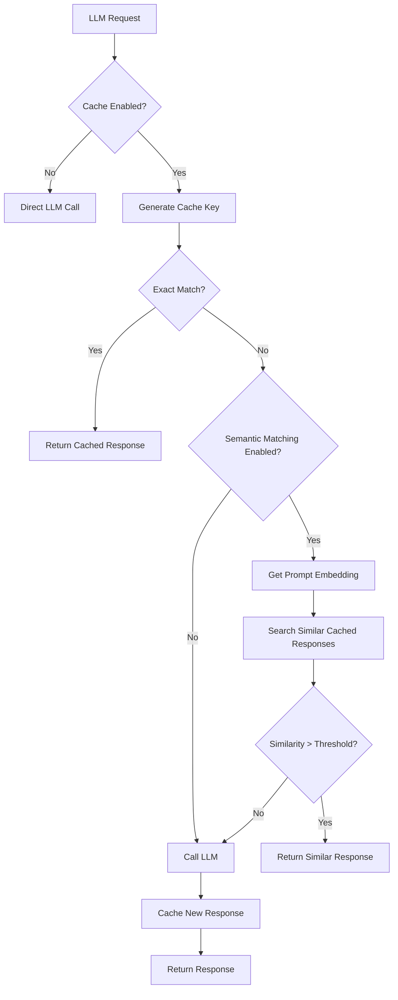

# Semantic Cache with Valkey

## Overview

The BotServer now supports semantic caching for LLM responses using Valkey (Redis-compatible in-memory database). This feature can significantly reduce response times and API costs by intelligently caching and reusing previous LLM responses.

## Features

- **Exact Match Caching**: Cache responses for identical prompts
- **Semantic Similarity Matching**: Find and reuse responses for semantically similar prompts
- **Configurable TTL**: Control how long cached responses remain valid
- **Per-Bot Configuration**: Enable/disable caching on a per-bot basis
- **Embedding-Based Similarity**: Use local embedding models for semantic matching
- **Statistics & Monitoring**: Track cache hits, misses, and performance metrics

## Configuration

### Enabling Semantic Cache

To enable semantic caching for a bot, add the following configuration to your bot's `config.csv` file:

```csv
llm-cache,true
llm-cache-ttl,3600
llm-cache-semantic,true
llm-cache-threshold,0.95
```

### Configuration Parameters

| Parameter | Type | Default | Description |
|-----------|------|---------|-------------|
| `llm-cache` | boolean | false | Enable/disable LLM response caching |
| `llm-cache-ttl` | integer | 3600 | Time-to-live for cached entries (in seconds) |
| `llm-cache-semantic` | boolean | true | Enable semantic similarity matching |
| `llm-cache-threshold` | float | 0.95 | Similarity threshold for semantic matches (0.0-1.0) |

### Embedding Service Configuration

For semantic similarity matching, ensure your embedding service is configured:

```csv
embedding-url,http://localhost:8082
embedding-model,../../../../data/llm/bge-small-en-v1.5-f32.gguf
```

## How It Works

### 1. Cache Key Generation

When a request is made to the LLM, a cache key is generated using:
- The prompt text
- The conversation context/messages
- The model being used

The key is hashed using SHA-256 to ensure consistent and secure storage.

### 2. Cache Lookup Process



### 3. Semantic Similarity Matching

When semantic matching is enabled:

1. The prompt is converted to an embedding vector using the configured embedding model
2. Recent cache entries for the same model are retrieved
3. Cosine similarity is computed between the prompt embedding and cached embeddings
4. If similarity exceeds the threshold, the cached response is used
5. The best matching response (highest similarity) is returned

### 4. Cache Storage

Cached responses include:
- The response text
- Original prompt
- Message context
- Model information
- Timestamp
- Hit counter
- Optional embedding vector

## Performance Benefits

### Response Time Improvements

- **Exact matches**: ~1-5ms response time (vs 500-5000ms for LLM calls)
- **Semantic matches**: ~10-50ms response time (includes embedding computation)
- **Cache miss**: No performance penalty (parallel caching)

### Cost Savings

- Reduces API calls to external LLM services
- Lowers token consumption for repeated or similar queries
- Efficient memory usage with configurable TTL

## Use Cases

### 1. FAQ Bots
Perfect for bots that answer frequently asked questions where similar queries should return consistent responses.

### 2. Customer Support
Cache responses for common support queries, reducing response time and ensuring consistency.

### 3. Educational Bots
Reuse explanations and educational content for similar learning queries.

### 4. Translation Services
Cache translations for commonly translated phrases and sentences.

## Management

### Viewing Cache Statistics

The cache system provides statistics including:
- Total cache entries
- Total hits across all entries
- Storage size in bytes
- Distribution by model

### Clearing the Cache

To clear the cache programmatically:
- Clear all entries: Remove all cached responses
- Clear by model: Remove cached responses for a specific model

### Monitoring Cache Performance

Monitor these metrics:
- **Hit Rate**: Percentage of requests served from cache
- **Similarity Distribution**: Distribution of similarity scores for semantic matches
- **TTL Effectiveness**: How often entries expire before being used

## Best Practices

1. **Set Appropriate TTL**: Balance between freshness and cache effectiveness
   - Short TTL (300-900s) for dynamic content
   - Long TTL (3600-86400s) for stable content

2. **Tune Similarity Threshold**: Adjust based on your use case
   - Higher threshold (0.95-0.99) for precise matching
   - Lower threshold (0.85-0.95) for more flexible matching

3. **Monitor Cache Size**: Ensure Valkey has sufficient memory for your cache needs

4. **Use Semantic Matching Wisely**: 
   - Enable for conversational bots
   - Disable for highly specific or technical queries

5. **Regular Cache Maintenance**: Periodically clear old or unused entries

## Troubleshooting

### Cache Not Working

1. Verify Valkey/Redis is running and accessible
2. Check `llm-cache` is set to `true` in config.csv
3. Ensure sufficient memory is available in Valkey
4. Check logs for connection errors

### Poor Semantic Matching

1. Verify embedding service is running
2. Check embedding model is appropriate for your language/domain
3. Adjust similarity threshold
4. Consider using a better embedding model

### High Memory Usage

1. Reduce TTL values
2. Limit max cache entries
3. Clear cache periodically
4. Monitor cache statistics

## Architecture

### Components

```
┌─────────────┐     ┌──────────────┐     ┌─────────────┐
│  Bot Module │────▶│ Cached LLM   │────▶│   Valkey    │
└─────────────┘     │   Provider   │     └─────────────┘
                    └──────────────┘
                           │
                           ▼
                    ┌──────────────┐     ┌─────────────┐
                    │ LLM Provider │────▶│  LLM API    │
                    └──────────────┘     └─────────────┘
                           │
                           ▼
                    ┌──────────────┐     ┌─────────────┐
                    │  Embedding   │────▶│  Embedding  │
                    │   Service    │     │    Model    │
                    └──────────────┘     └─────────────┘
```

### Cache Key Structure

```
llm_cache:{bot_id}:{model}:{content_hash}
```

Example:
```
llm_cache:550e8400-e29b-41d4-a716-446655440000:gpt-4:a665a45920422f9d417e4867efdc4fb8a04a1f3fff1fa07e998e86f7f7a27ae3
```

## Future Enhancements

- **Multi-level Caching**: L1 (memory) and L2 (disk) cache layers
- **Distributed Caching**: Share cache across multiple BotServer instances
- **Smart Eviction**: LRU/LFU strategies for cache management
- **Cache Warming**: Pre-populate cache with common queries
- **Analytics Dashboard**: Visual monitoring of cache performance
- **Compression**: Compress cached responses for memory efficiency