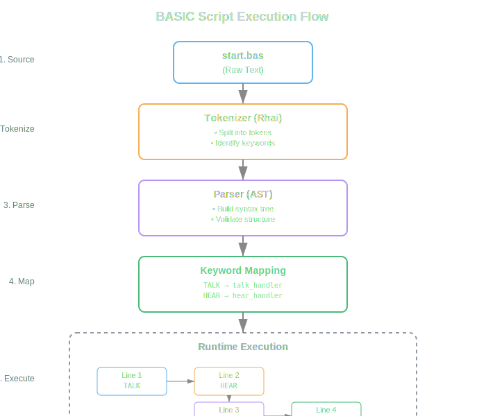

# Dialog Basics

BASIC dialogs are plain‑text scripts that the GeneralBots engine compiles into an abstract syntax tree (AST). The language is intentionally simple, using English‑like keywords.

## Core Concepts

* **Lines** – Each line is either a command (`TALK`, `HEAR`, etc.) or a comment (`REM` or `'`).
* **Variables** – Simple assignment with `name = value`. Types are inferred at runtime.
* **Control Flow** – `IF … THEN … END IF`, `FOR … NEXT`.
* **Comments** – Start with `REM` or apostrophe `'`.

## Example Script (`start.bas`)

```basic
REM Simple greeting dialog
user_name = "Guest"
TALK "Hello, " + user_name + "! How can I help you today?"
HEAR user_input
IF user_input = "help" THEN
    TALK "Sure, I can assist with account info, orders, or support."
ELSE
    TALK "Sorry, I didn't understand."
END IF
```

## Execution Model



1. **Parse** – The script is tokenized and turned into an AST.
2. **Compile** – Keywords are mapped to Rust functions (see `src/basic/keywords/`).
3. **Run** – The engine walks the AST, executing each node synchronously, while async tasks (e.g., LLM calls) are spawned as needed.

## Best Practices

* Keep scripts short; split complex flows into multiple `.gbdialog` files.
* Use `SET BOT MEMORY` for data that must persist across sessions.
* Avoid heavy computation inside the script; offload to LLM or external tools.
