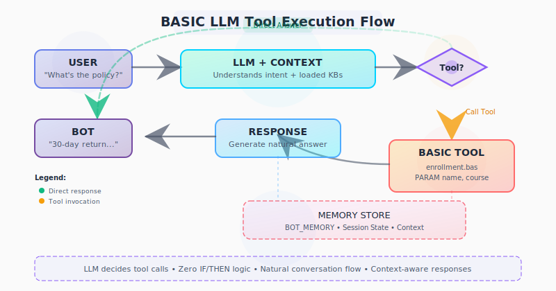

# Dialog Basics

BASIC dialogs in General Bots are designed for the LLM era - you write tools and context setters, not complex conversation flows. The LLM handles the natural language understanding and conversation management.

## Core Concepts

* **LLM Tools** – BASIC scripts that become callable tools for the LLM
* **Context Management** – SET_CONTEXT to provide knowledge to the LLM
* **Suggestions** – Guide conversations with ADD_SUGGESTION
* **Memory** – GET_BOT_MEMORY/SET_BOT_MEMORY for persistent data
* **Simple Syntax** – English-like commands that anyone can write

## Modern LLM-First Example

Inspired by real production bots, here's how modern BASIC works:

```basic
' Load context from memory
resume = GET_BOT_MEMORY("announcements")
context = GET_BOT_MEMORY("company_info")

' Give LLM the context it needs
SET_CONTEXT "announcements" AS resume
SET_CONTEXT "company" AS context

' Guide the conversation
CLEAR_SUGGESTIONS
ADD_SUGGESTION "announcements" AS "Show me this week's updates"
ADD_SUGGESTION "company" AS "Tell me about the company"
ADD_SUGGESTION "general" AS "What services do you offer?"

' Start the conversation
TALK "I have the latest announcements and company information ready."
TALK "What would you like to know?"
```

## Creating LLM Tools

Instead of parsing user input, create tools the LLM can call:

```basic
' update-summary.bas - A tool the LLM can invoke
PARAM topic AS STRING LIKE "Q4 Results" DESCRIPTION "Topic to summarize"
PARAM length AS STRING LIKE "brief" DESCRIPTION "brief or detailed"

DESCRIPTION "Creates a summary of the requested topic"

' The tool logic is simple
data = GET_BOT_MEMORY(topic)
summary = LLM "Summarize this " + length + ": " + data
TALK summary
```

## Execution Flow



## Key Differences from Traditional Chatbots

| Traditional Approach | LLM + BASIC Approach |
|---------------------|---------------------|
| Parse user input manually | LLM understands naturally |
| Complex IF/ELSE trees | Tools with PARAMs |
| Validate every field | LLM handles validation |
| Design conversation flows | LLM manages conversation |
| Handle errors explicitly | LLM provides graceful responses |

## Best Practices for LLM Era

* **Write Tools, Not Flows** – Create reusable tools the LLM can invoke
* **Use Context Wisely** – Load relevant knowledge with SET_CONTEXT
* **Trust the LLM** – Don't micromanage conversation flow
* **Keep Tools Focused** – Each tool should do one thing well
* **Use Suggestions** – Guide users without forcing paths

## Real-World Pattern

From production bots - a practical tool pattern:

```basic
' schedule-appointment.bas - A real business tool
PARAM service AS STRING LIKE "consultation" DESCRIPTION "Type of appointment"
PARAM date AS DATE LIKE "tomorrow at 3pm" DESCRIPTION "Preferred date and time"
PARAM notes AS STRING DESCRIPTION "Additional notes or requirements"

DESCRIPTION "Schedules an appointment and sends confirmation"

' Simple tool logic - LLM handles the conversation
appointment = GET "api/appointments/available" WITH service, date
IF appointment.available THEN
  SET_BOT_MEMORY "last_appointment" AS appointment.id
  SEND EMAIL TO user.email WITH appointment.details
  TALK "Perfect! I've scheduled your " + service + " for " + date
  TALK "Confirmation sent to your email"
ELSE
  TALK "That time isn't available. Let me suggest alternatives..."
  alternatives = GET "api/appointments/suggest" WITH service, date
  TALK alternatives
END IF
```

The LLM naturally guides the conversation, understands context like "tomorrow" or "next week", and calls this tool when all information is gathered.

## Summary

BASIC in General Bots isn't about controlling conversation flow - it's about providing tools and context that LLMs can use intelligently. Write simple tools, let AI handle the complexity.