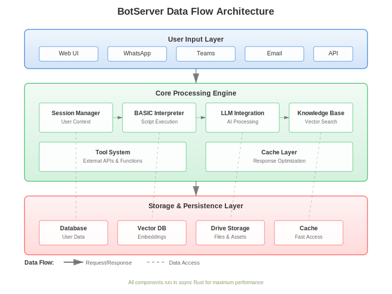
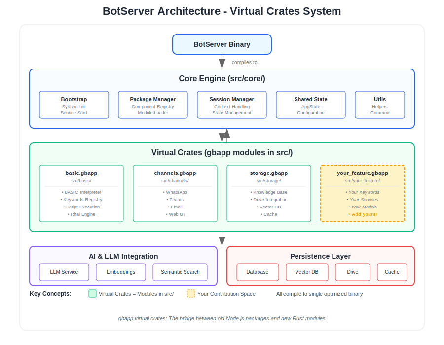
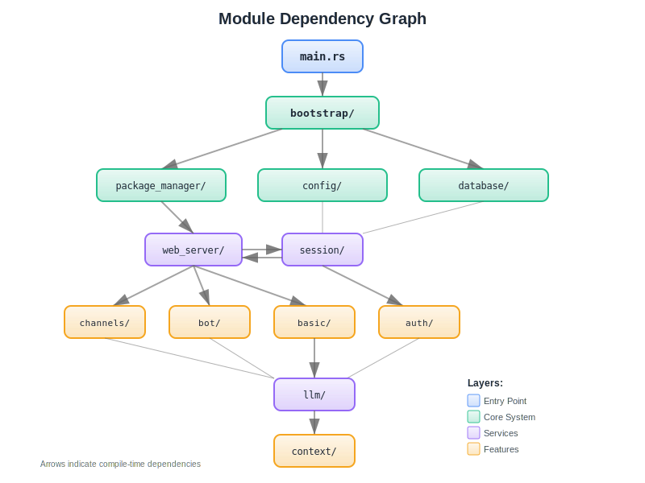
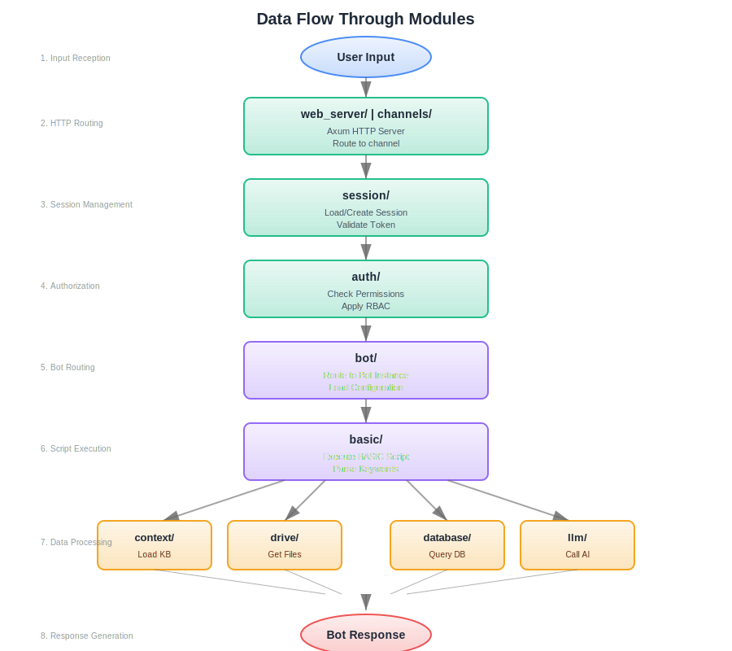

# Architecture Overview

BotServer follows a modular architecture designed for scalability, maintainability, and extensibility. Each module handles specific responsibilities and communicates through well-defined interfaces.

## Core Architecture

### Data Flow Architecture

### System Architecture

## Module Dependency Graph

## Module Organization

### Data Flow Through Modules

### Core Modules

#### `auth/`
Authentication and authorization system handling:
- User management
- Group/organization management
- Role-based access control (RBAC)
- JWT token management
- OAuth integration
- Two-factor authentication

#### `automation/`
Workflow automation engine providing:
- Process automation
- Scheduled tasks
- Event-driven automation
- Workflow orchestration
- Integration with external systems

#### `basic/`
BASIC dialect interpreter and runtime:
- Keyword implementation
- Script compilation
- Variable management
- Flow control
- Tool integration
- Error handling

#### `bootstrap/`
System initialization and startup:
- Component verification
- Service startup sequencing
- Database migrations
- Template deployment
- Health checks
- Configuration loading

#### `bot/`
Bot instance management:
- Bot lifecycle (create, mount, unmount)
- Conversation handling
- User input processing
- Response generation
- Multi-bot coordination
- Session isolation

### Communication Modules

#### `channels/`
Multi-channel messaging adapters:
- Web interface
- WhatsApp Business API
- Microsoft Teams
- Slack
- Instagram
- SMS
- Voice

#### `meet/`
Real-time communication features:
- Video conferencing
- Voice calls
- Screen sharing
- Recording
- Transcription
- Meeting scheduling

#### `web_server/`
HTTP server and web interface:
- Static file serving
- WebSocket handling
- REST API routing
- CORS management
- Request/response processing

### AI & Knowledge Modules

#### `llm/`
Large Language Model integration:
- Model selection
- Prompt formatting
- Token management
- Response streaming
- Cost tracking
- Model fallbacks

#### `llm_models/`
Specific model implementations:
- OpenAI (GPT-3.5, GPT-4)
- Anthropic (Claude)
- Google (Gemini)
- Meta (Llama)
- Local models
- Custom models

#### `prompt_manager/`
Centralized prompt management:
- Prompt templates
- Variable substitution
- Model-specific optimization
- Version control
- A/B testing
- Performance tracking

#### `context/`
Conversation context management:
- Context window optimization
- History management
- Context compression
- Relevance filtering
- Multi-turn tracking

### Storage & Data Modules

#### `drive/`
File and document management:
- File upload/download
- Document processing
- Version control
- Sharing permissions
- Quota management
- Search indexing

#### `drive_monitor/`
Storage monitoring and sync:
- Change detection
- Auto-sync
- Conflict resolution
- Backup management
- Storage analytics

#### `package_manager/`
Bot package management:
- Package loading
- Dependency resolution
- Version management
- Hot reload
- Package validation

### Processing Modules

#### `engines/`
Various processing engines:
- Rule engine
- Workflow engine
- Event processor
- Message queue
- Job scheduler

#### `calendar_engine/`
Calendar and scheduling:
- Event management
- Availability checking
- Meeting coordination
- Reminder system
- Timezone handling

#### `task_engine/`
Task management system:
- Task creation
- Assignment
- Status tracking
- Dependencies
- Notifications

#### `email/`
Email integration:
- SMTP sending
- IMAP receiving
- Template management
- Tracking
- Bounce handling

### Utility Modules

#### `session/`
User session management:
- Session creation
- State persistence
- Session timeout
- Concurrent sessions
- Session recovery

#### `config/`
Configuration management:
- Config loading
- Environment variables
- Hot reload
- Validation
- Defaults

#### `shared/`
Shared utilities and models:
- Database models
- Common types
- Helper functions
- Constants
- Error types

#### `compliance/`
Regulatory compliance:
- GDPR compliance
- Data retention
- Audit logging
- Privacy controls
- Consent management

#### `nvidia/` 
GPU acceleration support:
- CUDA integration
- Model inference
- Batch processing
- Performance optimization

#### `ui_tree/`
UI component tree management:
- Virtual DOM
- Component lifecycle
- State management
- Event handling
- Rendering optimization

#### `web_automation/`
Web scraping and automation:
- Browser automation
- Content extraction
- Form filling
- Screenshot capture
- Change monitoring

## Data Flow

### Request Processing Pipeline

1. **Channel Adapter** receives user input
2. **Session Manager** identifies/creates session
3. **Context Manager** loads conversation history
4. **BASIC Interpreter** executes dialog script
5. **LLM Integration** processes natural language
6. **Knowledge Base** provides relevant information
7. **Response Generator** formats output
8. **Channel Adapter** delivers response

### Storage Architecture

#### Primary Database (PostgreSQL)
- User accounts
- Bot configurations
- Session data
- Conversation history
- System metadata

#### Object Storage (Drive)
- File uploads
- Document storage
- Media files
- Backups
- Logs

#### Cache Layer
- Session cache
- Frequently accessed data
- Rate limiting
- Temporary storage
- Pub/sub messaging

#### Vector Database (Qdrant)
- Document embeddings
- Semantic search index
- Knowledge base vectors
- Similarity matching

## Security Architecture

### Authentication Flow
1. User provides credentials
2. Auth module validates
3. JWT token issued
4. Token verified on each request
5. Session established
6. Permissions checked

### Data Protection
- Encryption at rest (database, files)
- Encryption in transit (TLS/SSL)
- Sensitive data masking
- PII detection
- Secure key management

### Access Control
- Role-based permissions
- Resource-level authorization
- API rate limiting
- IP allowlisting
- Audit logging

## Deployment Architecture

### Container Structure
- Main application container
- PostgreSQL database
- Drive storage (S3-compatible)
- Cache (Valkey)
- Qdrant vector DB
- Nginx reverse proxy

### Scaling Strategy
- Horizontal scaling for web servers
- Read replicas for database
- Distributed cache
- Load balancing
- Auto-scaling policies

### High Availability
- Multi-zone deployment
- Database replication
- Storage redundancy
- Health monitoring
- Automatic failover

## Performance Optimization

### Caching Strategy
- Response caching
- Query result caching
- Static asset caching
- API response caching
- Knowledge base caching

### Async Processing
- Background jobs
- Message queues
- Event-driven architecture
- Non-blocking I/O
- Worker pools

### Resource Management
- Connection pooling
- Memory management
- Token optimization
- Query optimization
- Lazy loading

## Monitoring & Observability

### Metrics Collection
- System metrics
- Application metrics
- Business metrics
- User analytics
- Performance tracking

### Logging
- Structured logging
- Log aggregation
- Error tracking
- Audit trails
- Debug logging

### Health Checks
- Liveness probes
- Readiness probes
- Dependency checks
- Performance monitoring
- Alert system

## Extension Points

### Plugin System
- Custom keywords
- External tools
- API integrations
- Custom channels
- Model providers

### Webhook Support
- Incoming webhooks
- Outgoing webhooks
- Event subscriptions
- Callback handling
- Retry mechanisms

### API Integration
- REST API
- GraphQL (planned)
- WebSocket
- gRPC (planned)
- OpenAPI spec

## Development Workflow

### Local Development
1. Clone repository
2. Install dependencies
3. Configure environment
4. Run migrations
5. Start services
6. Load templates

### Testing Strategy
- Unit tests
- Integration tests
- End-to-end tests
- Load testing
- Security testing

### CI/CD Pipeline
- Automated testing
- Code quality checks
- Security scanning
- Build process
- Deployment automation

## Future Architecture Plans

### Planned Enhancements
- Microservices migration
- Kubernetes native
- Multi-region support
- Edge deployment
- Serverless functions

### Performance Goals
- Sub-100ms response time
- 10,000+ concurrent users
- 99.99% uptime
- Elastic scaling
- Global CDN

