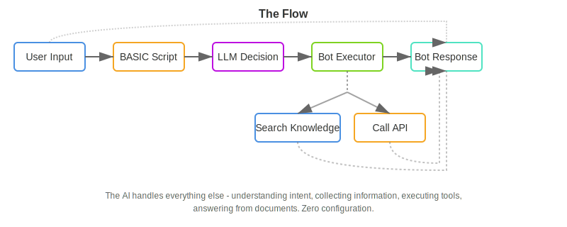
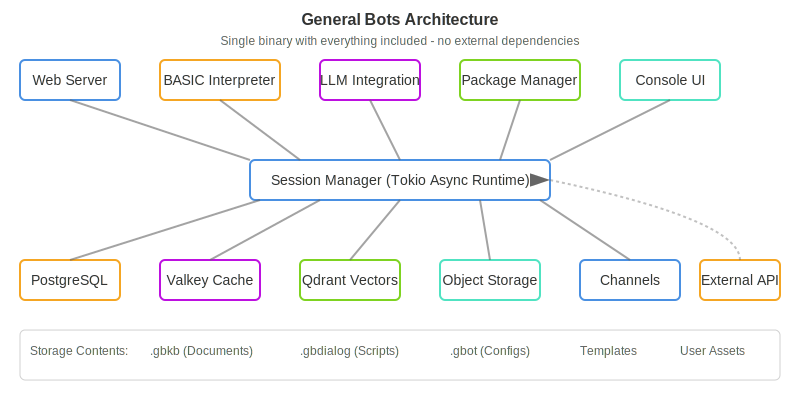
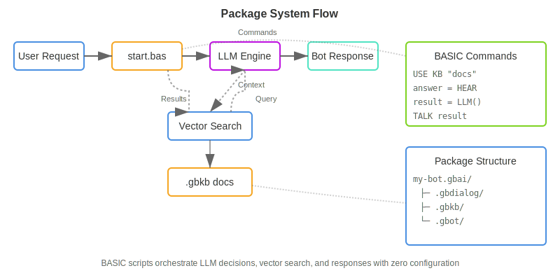

# Introduction to BotServer

**Build conversational AI bots in minutes, not months.** BotServer lets you create intelligent chatbots by writing simple [BASIC scripts](./chapter-02/gbdialog.md) and dropping in your [documents](./chapter-02/gbkb.md). No complex frameworks, no cloud dependencies, no AI expertise required.

## Quick Example

Want a student enrollment bot? Here's all you need:

1. **Drop your documents** in a [`.gbkb` folder](./chapter-02/gbkb.md):
```
edu.gbkb/
  enrollment-policy.pdf
  course-catalog.pdf
```

2. **Write a simple [tool](./chapter-03/kb-and-tools.md)** (optional):
```basic
' enrollment.bas
PARAM name, email, course
SAVE "enrollments.csv", name, email, course
TALK "Welcome to " + course + "!"
```

3. **Chat naturally**:
```
User: I want to enroll in computer science
Bot: I'll help you enroll! What's your name?
User: Sarah Chen
Bot: Welcome to Computer Science, Sarah!
```

### The Flow



The AI handles everything else - understanding intent, collecting information, executing tools, answering from documents. Zero configuration.

## What Makes BotServer Different

### [Just Run It](./chapter-01/quick-start.md)
```bash
./botserver
```
That's it. No Kubernetes, no cloud accounts. The [bootstrap process](./chapter-01/installation.md) installs everything locally in 2-5 minutes. [PostgreSQL](./chapter-07/postgresql.md), [vector database](./chapter-03/vector-collections.md), [object storage](./chapter-07/minio.md), [cache](./chapter-03/caching.md) - all configured automatically with secure credentials.

### Real BASIC, Real Simple
Remember BASIC from the 80s? We brought it back for conversational AI. See our [complete keyword reference](./chapter-05/README.md):
```basic
' save-note.bas - A simple tool
PARAM topic, content
SAVE "notes.csv", topic, content, NOW()
TALK "Note saved!"
```

Four lines. That's a working tool the AI can call automatically.

### Documents = Knowledge
Drop PDFs, Word docs, or text files into `.gbkb/` folders. They're instantly searchable. No preprocessing, no configuration, no pipelines. The bot answers questions from your documents automatically.

### Tools = Functions
Create `.bas` files that the AI discovers and calls automatically. Need to save data? Send emails? Call APIs? Just write a tool. The AI figures out when and how to use it.

## Architecture at a Glance

BotServer is a single binary that includes everything:



One process, one port, one command to run. Deploy anywhere - laptop, server, container.

## Real-World Use Cases

### Customer Support Bot
```
documents: FAQs, policies, procedures
tools: ticket creation, status lookup
result: 24/7 support that actually helps
```

### Employee Assistant
```
documents: HR policies, IT guides, company info
tools: leave requests, equipment orders
result: Instant answers, automated workflows
```

### Sales Catalog Bot
```
documents: product specs, pricing sheets
tools: quote generation, order placement
result: Interactive product discovery
```

### Meeting Assistant
```
documents: agenda, previous minutes
tools: action item tracking, scheduling
result: AI-powered meeting facilitator
```

## The Package System

Bots are organized as packages - just folders with a naming convention:

```
my-bot.gbai/                    # Package root
├── my-bot.gbdialog/            # BASIC scripts
│   └── start.bas               # Entry point
├── my-bot.gbkb/                # Knowledge base
│   ├── policies/               # Document collection
│   └── procedures/             # Another collection
└── my-bot.gbot/                # Configuration
    └── config.csv              # Bot settings
```

### How It Works



That's it. No XML, no JSON schemas, no build process. Copy the folder to deploy.

## Getting Started in 3 Steps

### 1. Install (2 minutes)
```bash
wget https://github.com/GeneralBots/BotServer/releases/latest/botserver
chmod +x botserver
./botserver
```

### 2. Open Browser
```
http://localhost:8080
```

### 3. Start Chatting
The default bot is ready. Ask it anything. Modify `templates/default.gbai/` to customize.

## Core Philosophy

1. **Simplicity First** - If it needs documentation, it's too complex
2. **Everything Included** - No external dependencies to manage
3. **Production Ready** - Secure, scalable, enterprise-grade from day one
4. **Developer Friendly** - Clear errors, hot reload, great debugging
5. **AI Does the Work** - Don't write logic the LLM can handle

## Technical Highlights

- **Language**: Written in Rust for performance and safety
- **Database**: PostgreSQL with Diesel ORM
- **Cache**: Valkey (Redis-compatible) for sessions
- **Storage**: S3-compatible object store
- **Vectors**: Qdrant for semantic search
- **Security**: Argon2 passwords, AES encryption
- **LLM**: OpenAI API or local models
- **Scripting**: Rhai-powered BASIC interpreter

## What's Next?

- **[Chapter 01](./chapter-01/README.md)** - Install and run your first bot
- **[Chapter 02](./chapter-02/README.md)** - Understanding packages
- **[Chapter 05](./chapter-05/README.md)** - Writing BASIC dialogs
- **[Templates](./chapter-02/templates.md)** - Explore example bots

## Community

BotServer is open source (AGPL-3.0) developed by Pragmatismo.com.br and contributors worldwide.

- **GitHub**: https://github.com/GeneralBots/BotServer
- **Version**: 6.0.8
- **Status**: Production Ready

Ready to build your bot? Turn to [Chapter 01](./chapter-01/README.md) and let's go!